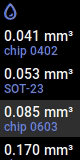

SMT solder paste and flux dispenser
===================================

**WIP**

> Motorized dispenser for SMT boards soldering. Compact, cheap & easy to do.

Schematic & PCB:

- [EasyEDA project page](https://easyeda.com/puzrin/dispenser) - order PCB and
  all components in couple of clicks.

Project page on [hackaday.io](https://hackaday.io/project/166699-solder-paste-and-flux-dispenser).
See progress and other tips in build logs.

## Build & usage

- [Assembly guide](doc/assembly.md)
- [User manual](doc/manual.md)

If you plan to develop new features or create fixes - see
[Devolopment notes](doc/development.md).
